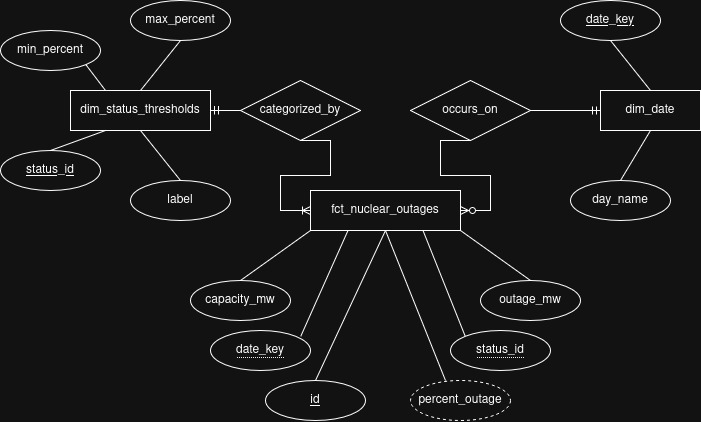

# AtomicPulse: US Nuclear Outages Data Pipeline
URL: https://atomic-pulse.onrender.com/
## Overview
An end-to-end data engineering pipeline that extracts daily nuclear power outage data from the EIA Open Data API, processes it into a dimensional model, and serves it via a RESTful API and a lightweight frontend interface.
___
## 🔘 Architecture & Technical Decisions
**Extra analysis**: https://c4mdax.github.io/posts/atomic-pulse/
### 1. Data Connector
- **Network Resilience:** Implemented robust HTTP requests using `urllib3`'s `Retry` strategy to gracefully handle transient API errors (502, 503) and rate limits (429).
- **Incremental Extraction:** The connector reads the latest processed date from local storage and only fetches new records, significantly reducing bandwidth and compute time compared to full historical loads.
- **Storage:** Raw data is compressed into `.parquet` using `pyarrow` (columnar storage with Snappy compression) before being loaded into the database.

### 2. Data Model (Star Schema Architecture)

To optimize **OLAP** (Online Analytical Processing) workloads, I implemented a **Star Schema**. This design minimizes join complexity and ensures the API remains highly responsive as the dataset grows.

#### Entities & Detailed Schema

* **`dim_status_thresholds` (Dimension):** Encapsulates the **Business Logic**. It defines severity tiers based on the percentage of power lost. Decoupling this logic into a dimension allows for updating global alert thresholds without modifying millions of historical records in the Fact Table.
    * **`status_id` (PK):** Unique identifier for the threshold tier (e.g., 1: Critical, 2: Warning, 3: Nominal).
    * **`label`:** Human-readable category (Nominal, Warning, Critical).
        * **Nominal (0% - 5%):** Normal operation or minor scheduled maintenance.
        * **Warning (5% - 15%):** Significant reduction in nuclear base-load; indicates multiple units are offline.
        * **Critical (+15%):** High-impact event indicating massive capacity loss that could strain national grid stability.
    * **`min_percent` / `max_percent`:** Numerical boundaries used by the ETL process to categorize each record.

* **`dim_date` (Dimension):** Provides temporal context. Using a surrogate `date_key` instead of standard timestamps allows for high-performance indexing and simplifies time-series grouping.
    * **`date_key` (PK):** Unique integer in `YYYYMMDD` format.
    * **`day_name`:** Descriptive attribute (e.g., "Monday") to analyze outage patterns based on the day of the week.

* **`fct_nuclear_outages` (Fact):** Houses the daily quantitative metrics. It is the "source of truth" for all system activity and the central hub of the Star Schema.
    * **`id` (PK):** Unique transaction identifier.
    * **`date_key` (FK):** References `dim_date(date_key)`.
    * **`status_id` (FK):** References `dim_status_thresholds(status_id)`.
    * **`capacity_mw`:** Total installed nuclear capacity at the time of record.
    * **`outage_mw`:** Total capacity currently offline.
    * **`percent_outage`:** Derived metric representing the percentage of the fleet affected.

#### Cardinality & Data Integrity

* **1:N (One-to-Many):** Each record in `dim_date` and `dim_status_thresholds` can be associated with multiple entries in `fct_nuclear_outages`.
* **Referential Integrity:** Enforced via Foreign Key constraints to prevent orphaned records and ensure that every outage entry maps to a valid date and severity tier.


### 3. REST API
- **Framework:** Built with **FastAPI** for native async support, strict data validation (Pydantic), and auto-generated OpenAPI documentation.
- **Security:** Endpoints are protected via an `APIKeyHeader` injected using dependency injection (`Depends`), ensuring business logic remains clean.
- **Performance:** Pagination (`LIMIT` and `OFFSET`) is handled entirely at the database level to prevent memory overloads on the server.

### 4. Frontend Interface
- **Tech Stack:** Vanilla JavaScript, HTML, and CSS. Zero external heavy dependencies (no React/Angular) for maximum speed and simplicity.
- **AI Assistance:** My first implementation of the interface was very basic, as my strength and main focus is not the frontend; however, with the help of an AI prompt, I managed to obtain and standardize a clean, modern, and descriptive interface.
___
## 🔘 Quick start Instructions

### 1. Prerequisites
- Python 3.9+
- Git

### 2. Installation (venv is desired)
```bash
git clone https://github.com/c4mdax/nuclear-data-pipeline.git
cd nuclear-data-pipeline
python -m venv venvNuclear
source venvNuclear/bin/activate
```

### 3. Environment Variables
Create a `.env` file in the root directory:
```bash
EIA_API_KEY=your_official_eia_api_key_here
APP_API_KEY=vegeta>goku123
```
### 4. Running Locally
**Start the Server**
```bash
uvicorn src.api:app --host 0.0.0.0 --port 8000
```
Navigate to `http://localhost:8000/`
___
## 🔘 Assumptions made
To ensure the reliability of the **AtomicPulse** pipeline, the following technical and business assumptions were implemented:

1.  **Data Granularity & Aggregation:** It is assumed that the EIA Open Data API (Route: `nuclear-outages`) provides a national-level daily snapshot. The pipeline treats this as a time-series set where each entry represents the total US nuclear fleet status for that specific date.
2.  **Storage Efficiency (Parquet vs. SQL):** I assumed a two-stage storage strategy. Raw data is first persisted in **Apache Parquet** format to leverage columnar compression and schema evolution safety. This acts as a "Data Lake" layer, while the SQLite Star Schema serves as the "Data Warehouse" layer for API consumption.
3.  **Threshold Justification (15% Criticality):** The 15% threshold for "Critical" status assumes a high-impact grid event. In a national context of ~95,000 MW, a 15% outage means more than 14,000 MW are offline, which is the threshold where grid stability historically becomes a major concern for ISOs (Independent System Operators).
4.  **Idempotency in ETL:** The `db_builder.py` script assumes that if a `date_key` already exists, it should not be duplicated. This ensures that multiple runs of the pipeline do not corrupt the historical analytical set.
5.  **Security Model:** The use of `X-API-Key` via FastAPI dependencies assumes a "Service-to-Service" (S2S) communication model, where the frontend acts as a trusted client.
___
## 🔘 Result examples
### Without GUI
- **/data endpoint**:
```json
id	1
"date_key":	"2026-03-26",
"status_id":	3,
"capacity_mw":	100013.2,
"outage_mw":	19738.455,
"percent_outage":	19.74
```
- **/refresh endpoint**:
```json
"status":	"success",
"message":	"No new data found. Database is up to date.",
"records_processed":	0 
```
- **/summary endpoint**:
```json
{
"total_records":	7026,
"avg_outage_mw":	9788.1,
"max_outage_mw":	32719.784
}
```
### With GUI


___
## Cloud Deployment
The application is hosted on a Render free instance. If the service is idle, it might take ~1 min to spin up on the first request."
- **Live URL:** https://atomic-pulse.onrender.com/
___
## Deliverables Checklist
- [x] Connector script (`src/connector.py`)
- [x] ER diagram (`ER_Diagram.jpg`)
- [x] API service (`src/api.py`)
- [x] Web application interface (`static/index.html`)
- [x] Cloud deployment


